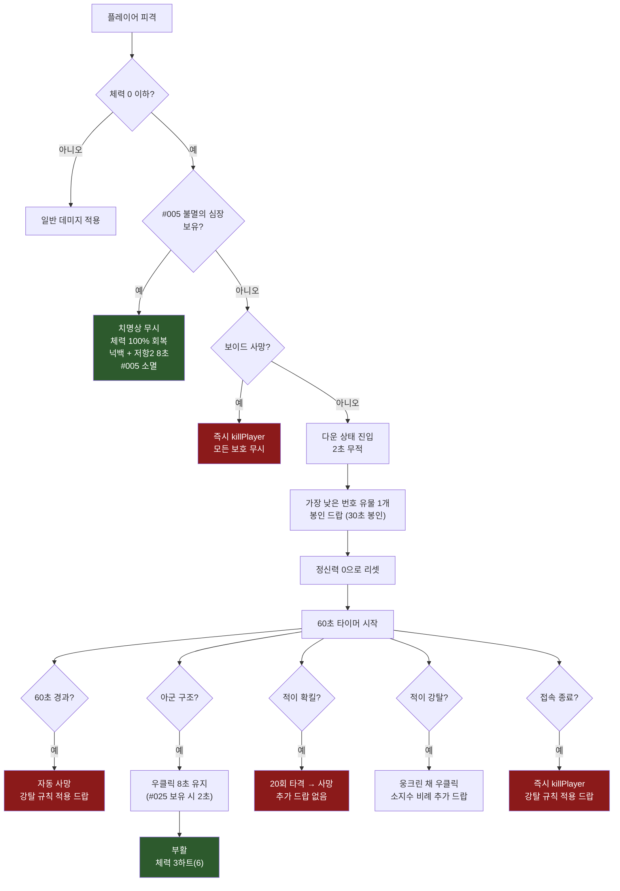

# RelicWars AI 개발 가이드라인

> [!NOTE]
> 이 문서는 코드 분석을 통해 검증된 데이터를 기반으로 작성되었습니다.
> AI 에이전트가 RelicWars 플러그인을 개발·수정할 때 반드시 참조해야 하는 핵심 레퍼런스입니다.
> **최종 갱신: 2026-06-15**

---

## 1. 프로젝트 개요

| 항목 | 내용 |
|------|------|
| 플러그인 이름 | **RelicWars** |
| 플랫폼 | Minecraft (Paper/Spigot) |
| 언어 | Java |
| 루트 패키지 | `com.wolfool.relicwars` |
| 핵심 컨셉 | 2인 팀 기반 유물 쟁탈 서바이벌 PvP |
| 데이터베이스 | SQLite (로컬 영속화) |

RelicWars는 31종의 고유 유물을 둘러싼 팀 전투·전략 플러그인입니다. 플레이어는 2인 팀을 구성하여 유물을 수집하고, 적 팀과 전투하며, 최종적으로 **왕좌의 핵(#000)**을 소환하여 제단 방어에 성공하면 승리합니다.

---

## 2. 패키지 구조

```
com.wolfool.relicwars
├── RelicWars.java              // 메인 플러그인 클래스 (onEnable/onDisable)
│
├── relic/
│   ├── RelicManager.java       // 유물 인벤토리 추적, 강탈 드랍 수량 계산
│   ├── RelicDefinition.java    // 31종 유물 정의 (번호/이름/티어/재질/쿨타임)
│   ├── RelicAbilityHandler.java // 유물별 능력 실행 메서드
│   ├── RelicListener.java      // 유물 사용/줍기/버리기/상호작용 이벤트
│   ├── RelicItemUtil.java      // PDC(PersistentDataContainer) 키 유틸리티
│   └── SealedRelicManager.java // 봉인 유물 스폰, 타이머, 줍기 처리
│
├── combat/
│   ├── CombatManager.java      // 다운 상태, 확킬, 강탈, 구조 로직
│   └── CombatListener.java     // 데미지 이벤트, #005 패시브, #002 적출
│
├── sanity/
│   ├── SanityManager.java      // 정신력 수치 관리, 디버프 적용, 자연 회복
│   └── SanityListener.java     // 황금 사과 회복, 접속 종료 시 저장
│
├── team/
│   └── TeamManager.java        // 2인 팀 구성·관리
│
├── config/
│   └── ConfigManager.java      // config.yml 로딩·접근
│
├── data/
│   └── DatabaseManager.java    // SQLite 영속화
│
├── tracker/
│   └── FootprintTracker.java   // 유물 보유자 이동 경로 파티클 추적
│
└── event/
    └── EventManager.java       // 블러드 문, 잊혀진 유물 등 월드 이벤트
```

> [!IMPORTANT]
> 모든 매니저 클래스는 `RelicWars` 메인 클래스에서 초기화됩니다.
> 새로운 매니저를 추가할 경우 반드시 `onEnable()`에서 등록하세요.

---

## 3. 핵심 매니저 클래스

### 3.1 RelicWars (메인 클래스)
- 플러그인 생명주기 관리 (`onEnable` / `onDisable`)
- 모든 매니저 인스턴스 생성 및 의존성 주입
- 리스너 등록, 커맨드 등록

### 3.2 RelicManager
- 플레이어별 유물 인벤토리 추적
- 강탈(steal) 시 드랍 수량 계산
- 유물 최대 소지 제한 처리 (`max-per-player: 4`)

### 3.3 RelicDefinition
- 31종 유물의 정적 정의 데이터
- 각 유물: **번호(#000~#030)**, 이름, 티어(1~5+특수), 아이템 재질, 쿨타임
- 번호가 **낮을수록 강력한 유물** (최강 = #001 태초의 별, 특수 = #000 왕좌의 핵)

### 3.4 RelicAbilityHandler
- 유물별 능력 실행 로직 (`execute` 메서드)
- 쿨타임 관리 및 정신력 소비 처리
- 각 유물의 고유 이펙트·데미지·버프·디버프 적용

### 3.5 RelicListener
- `PlayerInteractEvent` → 유물 우클릭 사용
- 유물 줍기/버리기 제어
- 봉인 유물 상호작용 처리

### 3.6 SealedRelicManager
- 봉인 유물 월드 스폰 관리
- 봉인 타이머 (기본 30초) 이후 줍기 가능
- 봉인 해제 시각 효과

### 3.7 CombatManager
- **다운 상태** 진입·해제 관리
- 확킬 (20회 타격 → 사망)
- 강탈 (소지 유물 수 비례 추가 드랍)
- 구조 (아군 우클릭 8초)
- 보이드·접속종료 즉사 처리

### 3.8 CombatListener
- 데미지 이벤트 가로채기 및 다운 판정
- **#005 불멸의 심장** 패시브 처리 (치명상 1회 무시)
- **#002 탐욕의 적출자** 적출 처리

### 3.9 SanityManager
- 정신력 수치 추적 (최대 100)
- 자연 회복 (5/분)
- 구간별 디버프 자동 적용
- 유물 사용 시 정신력 소비

### 3.10 SanityListener
- 황금 사과 섭취 시 정신력 회복 (+20 / +50)
- 접속 종료 시 정신력 데이터 저장

### 3.11 TeamManager
- 2인 팀 생성·해산·조회
- 팀 결성 조건: 양 팀원의 유물 합계 ≤ 8개
- 아군 판별 (구조·아군 피해 판정에 사용)

### 3.12 기타 매니저
| 클래스 | 역할 |
|--------|------|
| `ConfigManager` | `config.yml` 값 로딩 및 Getter 제공 |
| `DatabaseManager` | SQLite를 통한 데이터 영속화 |
| `FootprintTracker` | 유물 보유자의 이동 경로를 파티클로 추적 (티어별 색상) |
| `EventManager` | 블러드 문 (15% 확률), 잊혀진 유물 이벤트 등 |

---

## 4. 게임 규칙 요약

### 핵심 규칙
1. **팀 구성**: 2인 1팀, 팀 결성 시 양측 유물 합계 **8개 이하**
2. **유물 소지 제한**: 1인당 최대 **4개**
3. **유물 강도 순서**: 번호가 낮을수록 강력 (#001 > #030)
4. **다운 시 유물 드랍**: 가장 낮은 번호(최강) 유물 1개가 **봉인 상태로 드랍** (30초 봉인)
5. **사망 시 인벤토리 유지**: 유물 외 일반 아이템은 보존 (`keep-inventory-on-death: true`)
6. **아군 피해 없음**: `friendly-fire-enabled: false`
7. **전투 태그**: 15초 (전투 중 로그아웃 방지)

### 승리 조건
- 팀의 유물 합계 **10개 이상** 보유 시 **왕좌의 핵(#000)** 소환 가능
- 왕좌의 핵 활성화 후 **30분간 제단 방어** 성공 시 승리

---

## 5. 유물 목록

> [!TIP]
> 유물 번호가 낮을수록 강력합니다. 티어는 1(최약)~5(최강)이며, #000은 특수 유물입니다.
> 정신력 소비는 티어에 따라 결정됩니다: 1~2단계 = 0, 3단계 = 10, 4단계 = 20, 5단계 = 30

### 티어 1 (정신력 소비: 0)

| # | 이름 | 재질 | 쿨타임 | 능력 요약 |
|---|------|------|--------|----------|
| 030 | 낙뢰의 심지 | `BLAZE_ROD` | 6분 | 시야 방향 낙뢰 (10뎀 + 넉백 + 발광 5초) |
| 029 | 추락왕의 깃털 | `FEATHER` | 5분 | 15초 낙하면역 + 더블점프 1회 |
| 028 | 심해의 폐 | `HEART_OF_THE_SEA` | 10분 | 3분 수중호흡 + 야시 + 돌핀그레이스 + 물웅덩이 소환 |
| 027 | 용암의 눈 | `MAGMA_CREAM` | 10분 | 15초 화염면역 + 용암걷기 + 불꽃 장벽 |
| 026 | 어둠매듭 | `SCULK_SHRIEKER` | 8분 | 10초 완전 은신 (투명 + 이름 숨김) |
| 025 | 최후의 봉합 | `STRING` | 15분 | 구조시간 8초→2초 + 구조 후 도주 버프 |

### 티어 2 (정신력 소비: 0)

| # | 이름 | 재질 | 쿨타임 | 능력 요약 |
|---|------|------|--------|----------|
| 024 | 붉은 봉합 | `RED_DYE` | 15분 | 30블록 내 다운 아군 텔레포트 소환 |
| 023 | 사냥꾼의 표식 | `BOW` | 12분 | 60초 대상 발광 + 받는 피해 10% 증가 |
| 022 | 탐욕의 동전 | `GOLD_INGOT` | 20분 | 가짜 봉인 유물 함정 (폭발 + 디버프) |
| 021 | 결투자의 파편 | `IRON_SWORD` | 25분 | 15블록 내 적과 20초 결투장 생성 |
| 020 | 소문의 등불 | `LANTERN` | 20분 | 봉인유물 스캔 또는 특정 유물 보유자 조회 |
| 019 | 봉인의 바늘 | `COMPASS` | 18분 | 50블록 내 봉인유물 시간 절반 또는 2배 |
| 018 | 흔적 렌즈 | `SPYGLASS` | 12분 | 200블록 내 유물 보유자 발자국 파티클 (티어별 색상) |

### 티어 3 (정신력 소비: 10)

| # | 이름 | 재질 | 쿨타임 | 능력 요약 |
|---|------|------|--------|----------|
| 017 | 왜곡의 닻 | `LODESTONE` | 40분 | 60초 닻 설치, 50블록 내 다운 시 닻으로 텔레포트 |
| 016 | 감시의 방패 | `SPYGLASS` | 30분 | 5분간 80블록 감시구역 (적/봉인유물/아군 다운 알림) |
| 015 | 회수자의 갈고리 | `FISHING_ROD` | 15분 | 20블록 내 봉인유물 3초 캐스팅 후 끌어오기 + 봉인시간 절반 |
| 014 | 전장의 뿔 | `GOAT_HORN` | 25분 | 아군 전원 60초 발광 + 이속1, 300블록 내 유물 보유자 탐지 |
| 013 | 탐욕의 뼈 | `BONE` | 45분 | 30블록 혈흔 마커 10초 스캔 (적 이름 + 거리) |
| 012 | 약탈자의 장갑 | `LEATHER` | 25분 | 10블록 내 적 정신력 30 강탈 + 흡수 |
| 011 | 공명의 종 | `BELL` | 30분 | 300블록 전체 유물 보유자 탐지 (3초 발광 + 빨간 기둥 파티클) |

### 티어 4 (정신력 소비: 20)

| # | 이름 | 재질 | 쿨타임 | 능력 요약 |
|---|------|------|--------|----------|
| 010 | 충격 코어 | `END_CRYSTAL` | 8분 | 15블록 강력 넉백 + 20블록 5초 EMP (모든 유물/상호작용 차단) |
| 009 | 파괴자의 서 | `BOOK` | 20분 | 50블록 내 봉인유물 즉시 봉인 파괴 |
| 008 | 그림자 막 | `PHANTOM_MEMBRANE` | 40분 | 3분 팀 전체 탐지 면역 + 가짜 신호 3개 |
| 007 | 파수꾼의 돔 | `SHIELD` | 30분 | 15초 8블록 절대 방어 돔 (적 진입/투사체 차단, 내부 구조 3초) |
| 006 | 차원 도약석 | `ENDER_PEARL` | 10분 | 30블록 순간이동 + 5초 내 재사용 시 피해/디버프 무효화 귀환 |

### 티어 5 (정신력 소비: 30)

| # | 이름 | 재질 | 쿨타임 | 능력 요약 |
|---|------|------|--------|----------|
| 005 | 불멸의 심장 | `TOTEM_OF_UNDYING` | 90분 | **패시브**: 치명상 1회 무시, 체력 100% 회복 + 넉백 + 저항2 8초 |
| 004 | 폭풍의 왕관 | `TRIDENT` | 20분 | 100블록 대상 지점 15초 폭풍 (1초마다 벼락 3개 + 둔화2) |
| 003 | 절대 좌표 나침반 | `RECOVERY_COMPASS` | 45분 | 유물 번호 입력 → 3분 실시간 정확 XYZ 추적 |
| 002 | 탐욕의 적출자 | `GHAST_TEAR` | 120분 | 다운된 적 우클릭 0.5초 → 모든 유물 강제 드랍 (봉인 아님) |
| 001 | 태초의 별 | `NETHER_STAR` | 150분 | **1회용**: 60초 비행 + 심판의 벼락(즉사) + 적 전원 좌표/체력/정신력 공유 |

### 특수 유물

| # | 이름 | 재질 | 쿨타임 | 능력 요약 |
|---|------|------|--------|----------|
| 000 | 왕좌의 핵 | `DRAGON_EGG` | - | **시즌 엔딩**: 30분 제단 방어 시 승리 |

---

## 6. 전투 흐름



### 6.1 다운 상태 진입
1. 체력이 0 이하로 떨어지면 **다운 상태** 진입
2. **2초간 무적** 부여 (추가 피해 방지)
3. 소지 유물 중 **가장 낮은 번호(최강)** 1개가 **봉인 유물**로 드랍 (30초 봉인)
4. 정신력이 **0으로 리셋**
5. **60초 타이머** 시작

### 6.2 구조 (Revive)
- **조건**: 아군이 다운된 팀원에게 우클릭 **8초** 유지
- **특수**: #025(최후의 봉합) 보유 시 구조 시간 **2초**로 단축 + 구조 후 도주 버프
- **부활 체력**: 3하트 (`combat.revive-health: 6`)

### 6.3 확킬 (Execute)
- 다운된 적을 **20회 타격** → 사망
- 확킬 시 **추가 유물 드랍 없음** (다운 시 이미 1개 드랍됨)

### 6.4 강탈 (Steal)
- 다운된 적에게 **웅크린 채 우클릭**
- 소지 유물 수에 비례하여 **추가 유물 드랍**:

| 소지 유물 수 | 추가 드랍 수 |
|:---:|:---:|
| 0~1개 | 0개 |
| 2~3개 | 1개 |
| 4개 | 2개 |
| 5+개 | 3개 |

> [!WARNING]
> 강탈로 드랍되는 유물도 **봉인 상태**(30초)로 드랍됩니다.
> 강탈 드랍 시에도 **가장 낮은 번호(강한 유물)** 순서로 드랍됩니다.

### 6.5 자동 사망 / 접속 종료
- **자동 사망**: 60초 경과 시 `killPlayer` 호출 (강탈 규칙 적용 드랍)
- **접속 종료(랜뽑)**: 다운 중 나가면 즉시 `killPlayer` 호출
- **보이드 사망**: 모든 보호를 무시하고 즉시 `killPlayer`

---

## 7. 정신력 시스템

### 7.1 기본 수치
| 항목 | 값 |
|------|-----|
| 최대 정신력 | **100** |
| 자연 회복 | **5 / 분** |
| 황금 사과 회복 | **+20** |
| 마법 황금 사과 회복 | **+50** |
| 다운 시 | **0으로 리셋** |

### 7.2 유물 사용 정신력 소비

| 티어 | 유물 범위 | 소비량 |
|:----:|:---------:|:------:|
| 1단계 | #030 ~ #025 | **0** |
| 2단계 | #024 ~ #018 | **0** |
| 3단계 | #017 ~ #011 | **10** |
| 4단계 | #010 ~ #006 | **20** |
| 5단계 | #005 ~ #001 | **30** |

### 7.3 디버프 구간


| 정신력 구간 | 디버프 |
|:-----------:|--------|
| **70 이하** | 멀미 5초 + 좀비 소리 |
| **40 이하** | 구속 1 + 채굴피로 1 (5초) |
| **10 이하** | 어둠 + 실명 (5초) + 독 1 (3초) |

> [!CAUTION]
> 디버프는 **누적 적용**됩니다. 정신력 10 이하일 경우 세 구간의 디버프가 모두 동시에 발동합니다.
> 다운 시 정신력이 0으로 리셋되므로, 부활 직후 최악의 디버프 상태가 됩니다.

---

## 8. config.yml 주요 값

```yaml
# ===== 유물 설정 =====
relic:
  max-per-player: 4                    # 1인당 최대 유물 소지 수

# ===== 전투 설정 =====
combat:
  execute-hits: 20                     # 확킬에 필요한 타격 횟수
  downed-auto-execute-seconds: 60      # 다운 후 자동 사망까지 시간 (초)
  downed-invincibility-seconds: 2      # 다운 직후 무적 시간 (초)
  revive-health: 6                     # 구조 후 체력 (6 = 3하트)
  revive-seconds: 8                    # 구조에 필요한 시간 (초)
  drop-relic-on-downed: true           # 다운 시 유물 드랍 여부
  downed-drop-seal-seconds: 30         # 다운 시 드랍 유물 봉인 시간 (초)
  death-drop-seal-seconds: 30          # 사망 시 드랍 유물 봉인 시간 (초)
  keep-inventory-on-death: true        # 사망 시 인벤토리 유지 (유물 제외)
  friendly-fire-enabled: false         # 아군 간 피해 허용 여부
  combat-tag-seconds: 15               # 전투 태그 지속 시간 (초)

# ===== 팀 설정 =====
team:
  max-members: 2                       # 팀 최대 인원
  max-total-relics-to-form: 8          # 팀 결성 시 양측 유물 합계 상한

# ===== 정신력 설정 =====
sanity:
  max: 100                             # 최대 정신력
  regen-per-minute: 5                  # 분당 자연 회복량
  golden-apple-restore: 20             # 황금 사과 회복량

# ===== 이벤트 설정 =====
event:
  blood-moon:
    chance-per-night: 0.15             # 매 밤 블러드 문 발생 확률 (15%)

# ===== 엔딩 설정 =====
ending:
  required-team-relics-to-summon: 10   # 왕좌의 핵 소환에 필요한 팀 유물 수
  altar-defense-minutes: 30            # 제단 방어 시간 (분)
```

> [!TIP]
> `config.yml` 값을 변경할 때는 반드시 `ConfigManager`의 Getter 메서드를 통해 접근하세요.
> 하드코딩된 매직 넘버 대신 항상 `ConfigManager`에서 값을 읽어야 합니다.

---

## 부록: 개발 시 주의사항

### A. 유물 추가 체크리스트
1. `RelicDefinition`에 번호/이름/티어/재질/쿨타임 정의 추가
2. `RelicAbilityHandler`에 능력 실행 메서드 구현
3. `RelicListener`에 필요한 이벤트 핸들러 추가
4. 패시브 유물일 경우 `CombatListener`에 패시브 처리 로직 추가
5. `SanityManager`의 티어별 소비량 매핑 확인

### B. PDC (PersistentDataContainer) 규칙
- 모든 유물 아이템은 `RelicItemUtil`의 PDC 키로 식별
- 유물 번호, 봉인 상태, 소유자 등의 메타데이터를 PDC에 저장
- 아이템 비교 시 반드시 PDC 기반으로 비교 (아이템 이름/lore 비교 금지)

### C. 이벤트 처리 우선순위
1. **보이드 사망** → 모든 보호 무시, 즉시 처리
2. **#005 불멸의 심장** → 다운 판정 전에 패시브 확인
3. **다운 상태** → 일반 치명상 시 진입
4. **전투 태그** → 15초 동안 전투 중 로그아웃 방지
