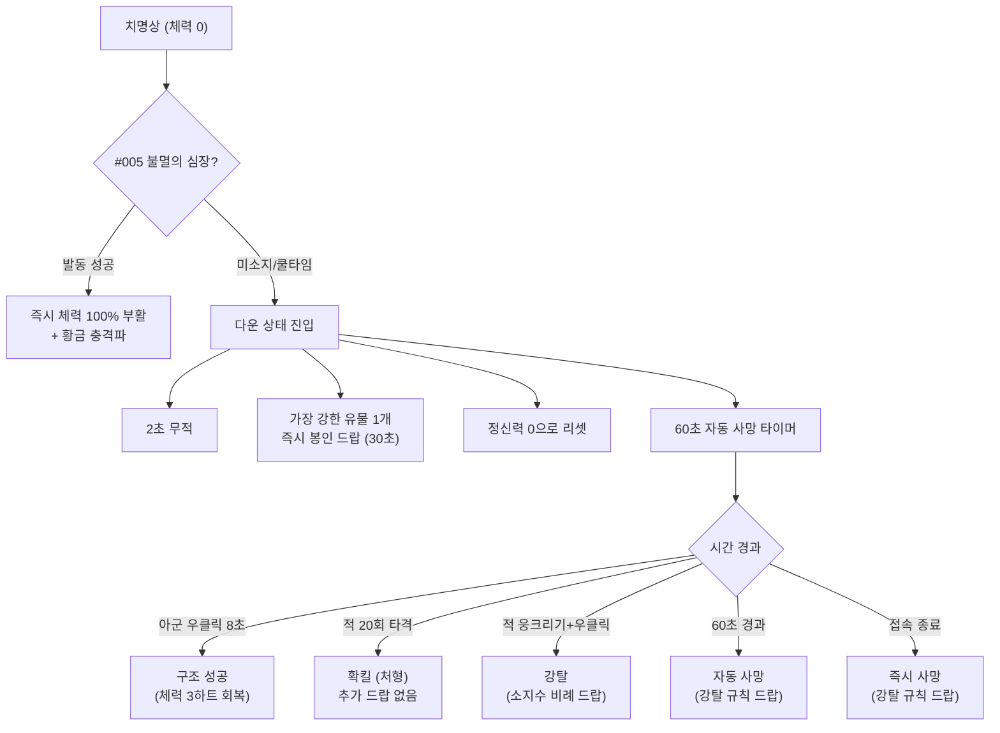
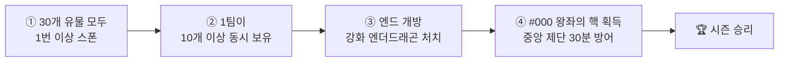

# RelicWars 설계 요약서 (Design Summary)

> **패키지:** `com.wolfool.relicwars` | **플랫폼:** Paper 1.21.x | **최종 갱신:** 2026-06-15
>
> 이 문서는 소스 코드에서 직접 검증된 데이터만을 기반으로 작성되었습니다.

---

## 1. 게임 개요

RelicWars는 **생존 + PvP + 보스전**이 결합된 마인크래프트 서바이벌 플러그인입니다.

- 서버에 **31개의 유물**(#000 ~ #030)이 존재하며, 각 유물은 세계에 **단 1개**만 존재합니다.
- 유물은 **보스 처치** 또는 **기믹 클리어**를 통해 획득합니다.
- 플레이어는 **최대 2인 팀**을 구성하여 유물을 수집하고 쟁탈합니다.
- 최종적으로 **#000 왕좌의 핵**을 획득한 뒤, 오버월드 중앙 제단에서 **30분간 방어에 성공**하면 시즌이 종료됩니다.

> [!IMPORTANT]
> 핵심 루프: **유물 스폰 탐지 → 보스/기믹 도전 → 유물 획득 → PvP 쟁탈 → 엔딩 도전**

---

## 2. 유물 시스템

### 2.1 유물 등급 (6단계)

> 번호가 **낮을수록 강력**합니다. 등급은 `RelicDefinition.java`의 `tier` 필드로 정의됩니다.

| 등급 | 색상 코드 | 번호 범위 | 정신력 소모 | 특징 |
|:---:|:---:|:---:|:---:|:---|
| **1단계** | `§7` WHITE | #030 ~ #025 | 0 | 기본 유틸리티, 개인 생존 특화 |
| **2단계** | `§9` BLUE | #024 ~ #018 | 0 | 전술적 유틸리티, 추격/국지전 보조 |
| **3단계** | `§a` GREEN | #017 ~ #011 | **10** | 전략적 능력, 파티 전술 핵심 |
| **4단계** | `§c` RED | #010 ~ #006 | **20** | 강력한 전투/전략, 시스템 조작 |
| **5단계** | `§6` GOLD | #005 ~ #001 | **30** | 극강 능력, 서버 통제급 |
| **특수** | `§5` PURPLE | #000 | - | 시즌 엔딩 유물 (왕좌의 핵) |

### 2.2 유물 획득 (봉인 시스템)

유물은 바닥에 드랍될 때 **봉인 상태(Sealed)**로 존재합니다.

```
[봉인 생성] → 봉인 타이머 카운트다운 → [타이머 0] → Claimable 상태
                                                        ↓
                                              우클릭 캐스팅 (2초) → 획득!
```

| 봉인 유형 | 봉인 시간 | 출처 |
|:---|:---:|:---|
| 다운 시 드랍 | 30초 | `combat.downed-drop-seal-seconds` |
| 사망 시 드랍 | 30초 | `combat.death-drop-seal-seconds` |
| 보스 드랍 | 60초 | `combat.boss-drop-seal-seconds` |

- 봉인 중인 유물은 **발광(Glowing) 이펙트**가 표시됩니다 (`relic.seal-glow: true`)
- Claimable 상태의 유물을 우클릭하면 **2초 캐스팅** 후 획득 (`relic.pickup-seconds: 2`)

### 2.3 유물 보관 규칙

| 규칙 | 상세 |
|:---|:---|
| 최대 소지 | **인당 4개** (`relic.max-per-player: 4`) |
| Q키 드랍 | ❌ **불가** (인벤토리 고정) |
| 상자 보관 | ❌ **불가** (인벤토리에만 존재) |
| 발동 방식 | **우클릭** 사용, 쿨타임 개별 적용 |

---

## 3. 전투 시스템

> 전투 흐름은 `CombatManager.java` + `CombatListener.java`에서 검증되었습니다.

### 3.1 전투 흐름도



### 3.2 다운 상태

체력이 0에 도달하면 바닐라 사망 대신 **다운 상태**에 진입합니다.

- **디버프:** 둔화 5 + 점프 불가(레벨 250) + 실명
- **제약:** 이동 극도 제한, 공격 불가, 아이템 사용 불가
- **즉시 효과:** 정신력 **0으로 리셋**, 가장 강한(번호 낮은) 유물 1개 **즉시 봉인 드랍**
- **무적:** 다운 직후 **2초간 무적** (`combat.downed-invincibility-seconds: 2`)
- **환경 면역:** 다운 중 용암·낙하 등 자연 데미지 면역 (`combat.downed-environmental-immunity: true`)

### 3.3 구조

- **조건:** 같은 팀 소속의 아군만 구조 가능
- **방법:** 다운된 팀원에게 **우클릭** (시선 고정 + 거리 4블록 이내 유지)
- **소요 시간:** 기본 **8초** (`combat.revive-seconds: 8`)
- **부활 체력:** **6 HP (하트 3칸)** (`combat.revive-health: 6`)

> [!TIP]
> `#025 최후의 봉합` 소지 시 구조 시간 **8초 → 2초** 단축 + 구조 후 신속 2/저항 1 버프

### 3.4 확킬 (처형)

- **방법:** 다운된 적에게 **근접 타격 20회** (`combat.execute-hits: 20`)
- **결과:** 사망 처리, **추가 유물 드랍 없음** (이미 다운 시 1개 드랍됨)

### 3.5 강탈

- **방법:** 다운된 적에게 **웅크린 채 우클릭**
- **드랍 규칙:** 피해자의 **남은 유물 소지 수**에 비례하여 추가 드랍

| 소지 유물 수 | 추가 드랍 개수 | config 키 |
|:---:|:---:|:---|
| 0 ~ 1개 | 0개 | `steal-drop-rules.0: "0-1"` |
| 2 ~ 3개 | 1개 | `steal-drop-rules.1: "2-3"` |
| 4개 | 2개 | `steal-drop-rules.2: "4-4"` |
| 5개 이상 | 3개 | `steal-drop-rules.3: "5-99"` |

- 드랍 우선순위: **높은 번호(약한 유물)부터** 드랍 (`highest_number`)

> [!NOTE]
> `#002 탐욕의 적출자`를 사용하면 웅크리기 없이 **0.5초 만에 즉시 적출** → 대상의 **모든 유물** 바닥 드랍

### 3.6 최종 사망

- **60초 경과 시 자동 사망:** 구조받지 못하면 `killPlayer()` 호출 → 강탈 규칙에 따라 추가 드랍
- **다운 중 접속 종료:** 즉시 `killPlayer()` 실행 → 강탈 규칙 드랍
- **보이드(공허) 사망:** 모든 보호(불멸의 심장·무적·환경 면역) **무시**, 즉시 `killPlayer()`
  - 보이드 유물 유실 방지를 위해 **안전 좌표 계산** 후 드랍 (`getSafeDropLocation()`)

### 3.7 랜뽑 방지 (Combat Log)

- 전투 태그 지속: **15초** (`combat.combat-tag-seconds: 15`)
- PvP 피격 시 양쪽 모두에게 전투 태그 부여
- 전투 태그 중 **강제 종료(랜뽑)** 시:
  1. 다운 패널티 (최강 유물 1개 드랍) 적용
  2. `killPlayer()` 실행 (강탈 규칙 추가 드랍)
  3. 서버 전체 공지: `"§c[RelicWars] OOO님이 전투 중 강제 종료(랜뽑)하여 처형되었습니다!"`

### 3.8 기타

- **KeepInventory:** 사망 시 일반 인벤토리(갑옷·검·자원 등) **보존** (`combat.keep-inventory-on-death: true`)
- **팀원 간 PvP:** 차단 (`combat.friendly-fire-enabled: false`)

---

## 4. 팀 시스템

> `TeamManager.java`에서 검증. DB(SQLite)에 팀 데이터가 영속 저장됩니다.

| 항목 | 상세 |
|:---|:---|
| 최대 인원 | **2명** (`team.max-members: 2`) |
| 결성 조건 | 팀원 합계 유물 **8개 이하** (`team.max-total-relics-to-form: 8`) |
| 초대 방식 | `/team invite <닉네임>` → `/team accept` |
| 초대 만료 | **60초** (`team.invite-expire-seconds: 60`) |
| 팀 유지 시간 | **2시간** (만료 시 자동 해체, 5분 전 경고) |
| 팀원 간 PvP | ❌ 불가 (friendly-fire 차단) |
| 탈퇴 | `/team leave` → 1인 이하 남으면 자동 해체 |

---

## 5. 정신력 시스템

> `SanityManager.java`에서 검증. DB에 영속 저장됩니다.

### 5.1 기본 수치

| 항목 | 값 |
|:---|:---|
| 최대 정신력 | **100** (`sanity.max: 100`) |
| 자연 회복 | **5 / 분** (`sanity.regen-per-minute: 5`) |
| 황금 사과 | **+20** (`sanity.golden-apple-restore: 20`) |
| 마법 황금 사과 | **+50** |
| 다운 시 | **0으로 리셋** |

### 5.2 유물 사용 비용

| 등급 | 정신력 소모 |
|:---:|:---:|
| 1~2단계 | 0 |
| 3단계 | 10 |
| 4단계 | 20 |
| 5단계 | 30 |

### 5.3 디버프 단계 (5초 주기 체크)

| 임계값 | 디버프 | 코드 근거 |
|:---:|:---|:---|
| **≤ 70** (70%) | 멀미(Nausea) + 10% 확률로 좀비 소리 | `PotionEffectType.NAUSEA` |
| **≤ 40** (40%) | 구속 1(Slowness) + 채굴피로 1(Mining Fatigue) | 5초(100틱) 지속 |
| **≤ 10** (10%) | 어둠(Darkness) + 실명(Blindness) + 독 1(Poison) | 3~5초 지속 |

---

## 6. 이벤트 시스템

> `EventManager.java`, `BloodMoonTask.java`, `ForgottenRelicTask.java`에서 검증.

### 6.1 핏빛 달 (Blood Moon)

| 항목 | 값 |
|:---|:---|
| 발생 확률 | 매 밤 **15%** (`event.blood-moon.chance-per-night: 0.15`) |
| 좌표 방송 주기 | **3분** (`broadcast-interval-minutes: 3`) |
| 좌표 오차 | **100단위 반올림** (`coordinate-blur: 100`) |
| 차원 정보 | 포함 (`broadcast-dimension: true`) |

- 핏빛 달이 뜨면 **유물 보유자의 대략적 좌표**가 서버 전체에 공개됩니다.

### 6.2 잊혀진 유물 (Forgotten Relics)

바닥에 **30분 이상 방치**된 유물은 단계적으로 좌표 힌트가 공개됩니다.

| 방치 시간 | 힌트 유형 | 예시 |
|:---:|:---|:---|
| 30분 | `direction` | "남서쪽에서 잊혀진 유물의 기운이 느껴집니다." |
| 60분 | `1000-blur` | X좌표 1000단위 흐림 |
| 90분 | `500-blur` | X좌표 500단위 흐림 |
| 120분 | `50-y-blur` | X, Z 50단위 흐림 + Y좌표 포함 |

---

## 7. 유물 목록

### 1단계 (WHITE) — #030 ~ #025 | 정신력 소모: 0

| # | 이름 | 아이템 | 쿨타임 | 능력 요약 |
|:---:|:---|:---|:---:|:---|
| #030 | 낙뢰의 심지 | `BLAZE_ROD` | 6분 | 바라보는 곳에 1.5초 뒤 낙뢰. 높은 데미지+넉백+5초 발광 |
| #029 | 추락왕의 깃털 | `FEATHER` | 5분 | 15초 낙하 데미지 면역 + 공중 이단 점프 1회 |
| #028 | 심해의 폐 | `HEART_OF_THE_SEA` | 10분 | 3분 수중 호흡/야간투시/빠른 수영 + 지상 물 소환 대쉬 |
| #027 | 용암의 눈 | `MAGMA_CREAM` | 10분 | 15초 화염/용암 면역 + 용암 보행 + 불길 장벽 생성 |
| #026 | 어둠매듭 | `SCULK_SHRIEKER` | 8분 | 10초 완벽 은신 (투명화+닉네임 숨김+발소리 제거+스컬크 무시) |
| #025 | 최후의 봉합 | `STRING` | 15분 | 구조 시간 8초→2초 + 구조 후 신속 2/저항 1 도주 버프 |

### 2단계 (BLUE) — #024 ~ #018 | 정신력 소모: 0

| # | 이름 | 아이템 | 쿨타임 | 능력 요약 |
|:---:|:---|:---|:---:|:---|
| #024 | 붉은 봉합 | `RED_DYE` | 15분 | 30블록 밖 다운 팀원을 내 위치로 순간이동 후 즉시 구조 시작 |
| #023 | 사냥꾼의 표식 | `BOW` | 12분 | 60초간 사냥 표식 (발광+투명화 무시). 표식 대상 피해 10% 증가 |
| #022 | 탐욕의 동전 | `GOLD_INGOT` | 20분 | 가짜 봉인 유물 트랩 설치. 적 우클릭 시 폭발+구속 2+발광 |
| #021 | 결투자의 파편 | `IRON_SWORD` | 25분 | 15블록 내 적과 15×15 강제 결투장 20초 생성 (진입/탈출/투사체 차단) |
| #020 | 소문의 등불 | `LANTERN` | 20분 | 서버 유물 정보 스캔: 봉인 유물 위치/시간 + 소유자 이름 확인 |
| #019 | 봉인의 바늘 | `COMPASS` | 18분 | 50블록 내 봉인 유물 시간 절반 단축 또는 2배 연장 |
| #018 | 흔적 렌즈 | `SPYGLASS` | 12분 | 200블록 내 유물 보유자의 3분간 발자국을 등급별 색상으로 추적 |

### 3단계 (GREEN) — #017 ~ #011 | 정신력 소모: 10

| # | 이름 | 아이템 | 쿨타임 | 능력 요약 |
|:---:|:---|:---|:---:|:---|
| #017 | 왜곡의 닻 | `LODESTONE` | 40분 | 공간 왜곡장 설치. 아군 다운 시 닻 위치로 자동 텔레포트 (확킬 회피) |
| #016 | 감시의 방패 | `SPYGLASS` | 30분 | 반경 80블록 감시 구역 5분간 전개. 적 진입/봉인 출현/아군 다운 경고 |
| #015 | 회수자의 갈고리 | `FISHING_ROD` | 15분 | 20블록 밖 Claimable 봉인 유물을 낚아채기. 획득 시간 절반 단축 |
| #014 | 전장의 뿔 | `GOAT_HORN` | 25분 | 15초간 아군 힘 1+저항 1 버프. 30블록 내 적 구속 2+청각 상실 |
| #013 | 탐욕의 뼈 | `BONE` | 45분 | 60초간 초월적 탐지: 모든 플레이어의 유물 개수+대략 위치를 5초마다 추적 |
| #012 | 약탈자의 장갑 | `LEATHER` | 25분 | 10블록 내 적 정신력 30 강탈 + 공포 연출 |
| #011 | 공명의 종 | `BELL` | 30분 | 반경 300블록 내 모든 유물 보유자 위치 3초간 강제 노출. 은신/투명화 관통 |

### 4단계 (RED) — #010 ~ #006 | 정신력 소모: 20

| # | 이름 | 아이템 | 쿨타임 | 능력 요약 |
|:---:|:---|:---|:---:|:---|
| #010 | 충격 코어 | `END_CRYSTAL` | 8분 | 반경 15블록 광역 넉백 + 5초간 반경 20블록 모든 상호작용/유물 능력 차단 |
| #009 | 파괴자의 서 | `BOOK` | 20분 | 50블록 내 봉인 유물의 봉인을 즉시 파괴 → Claimable 전환 |
| #008 | 그림자 막 | `PHANTOM_MEMBRANE` | 40분 | 3분간 팀 전체 모든 탐지 면역 + 가짜 신호 3개 생성 |
| #007 | 파수꾼의 돔 | `SHIELD` | 30분 | 반경 8블록 절대 방어막 15초. 적 진입/투사체 차단. 돔 내 구조 시간 3초 |
| #006 | 차원 도약석 | `ENDER_PEARL` | 10분 | 30블록 즉시 순간이동 + 5초 내 재사용 시 피해 무효화하며 원위치 복귀 |

### 5단계 (GOLD) — #005 ~ #001 | 정신력 소모: 30

| # | 이름 | 아이템 | 쿨타임 | 능력 요약 |
|:---:|:---|:---|:---:|:---|
| #005 | 불멸의 심장 | `TOTEM_OF_UNDYING` | 90분 | **[패시브]** 다운 직전 체력 100% 부활 + 황금 충격파 + 8초 피해 50% 감소 |
| #004 | 폭풍의 왕관 | `TRIDENT` | 20분 | 반경 30블록에 15초간 파멸적 뇌우 소환. 매초 벼락 데미지+구속 |
| #003 | 절대 좌표 나침반 | `RECOVERY_COMPASS` | 45분 | 특정 유물의 실시간 절대 좌표(X,Y,Z)를 3분간 추적 |
| #002 | 탐욕의 적출자 | `GHAST_TEAR` | 120분 | 다운된 적 우클릭 → 0.5초 즉시 적출. 대상의 **모든 유물** 바닥 강제 드랍 |
| #001 | 태초의 별 | `NETHER_STAR` | 150분 | 60초간 '태초의 지배자': 비행+무제한 심판 벼락+모든 유저 좌표 공유+정신력 무시 |

### 특수 — #000 | 시즌 엔딩

| # | 이름 | 아이템 | 능력 요약 |
|:---:|:---|:---|:---|
| #000 | 왕좌의 핵 | `DRAGON_EGG` | 중앙 제단에 바치고 30분 방어 시 시즌 종료. 탈취 시 타이머 즉시 리셋 |

---

## 8. 엔딩 조건

엔딩은 4단계로 구성됩니다:



| 조건 | 값 | config 키 |
|:---|:---:|:---|
| 전체 유물 스폰 필요 | `true` | `ending.required-all-spawned` |
| 팀 유물 보유 조건 | **10개** | `ending.required-team-relics-to-summon` |
| 제단 방어 시간 | **30분** | `ending.altar-defense-minutes` |

> [!WARNING]
> 제단에서 적에게 핵을 탈취당하면 방어 타이머가 **즉시 0으로 리셋**됩니다.

---

## 9. config.yml 초안

```yaml
# ============================================================
# RelicWars Configuration
# 이 파일의 모든 수치를 서버 관리자가 자유롭게 변경할 수 있습니다.
# 변경 후 /relic reload 명령어를 사용하면 서버 재시작 없이 즉시 반영됩니다.
# ============================================================

# --- 유물(Relic) 기본 설정 ---
relic:
  max-per-player: 4              # 1인당 최대 유물 보유 개수
  team-max-on-formation: 6       # 팀 결성 시 최대 유물 합계 (초과 시 랜덤 드랍)
  seal-glow: true                # 봉인 유물에 발광(Glowing) 이펙트 표시 여부
  pickup-seconds: 2              # 봉인 풀린 유물을 줍는 데 걸리는 캐스팅 시간 (초)

# --- 전투(Combat) 설정 ---
combat:
  downed-drop-seal-seconds: 30   # 다운 시 드랍되는 유물의 봉인 시간
  death-drop-seal-seconds: 30    # 자결/확킬 사망으로 드랍되는 유물의 봉인 시간
  boss-drop-seal-seconds: 60     # 보스가 드랍한 유물의 봉인 시간

  execute-hits: 20               # 다운된 유저를 확킬하는 데 필요한 타격 횟수 (무기/맨손 무관)
  downed-invincibility-seconds: 2  # 다운 직후 짧은 무적 시간
  downed-environmental-immunity: true  # 다운 상태에서 용암, 낙하 등 자연 데미지 면역
  revive-health: 6               # 구조(부활) 시 부활 체력 (하트 3칸 = 6 HP)
  revive-seconds: 8              # 팀원 구조에 걸리는 시간 (초)

  drop-relic-on-downed: true     # 다운 시 즉시 유물 드랍 여부
  downed-drop-selection: "highest_number"   # 다운 시 드랍 기준 (높은 번호 = 약한 유물부터)

  # 강탈(Steal) 드랍 규칙: 드랍 개수별 소유 범위 (드랍 개수: "최소소유~최대소유")
  steal-drop-rules:
    0: "0-1"     # 드랍 0개: 유물 0~1개 소유 시
    1: "2-3"     # 드랍 1개: 유물 2~3개 소유 시
    2: "4-4"     # 드랍 2개: 유물 4개 소유 시
    3: "5-99"    # 드랍 3개: 유물 5개 이상 소유 시

  final-death-drop-selection: "highest_number"  # 확킬 시 드랍 기준
  
  keep-inventory-on-death: true  # 사망 시 일반 인벤토리(갑옷, 검 등) 보존 여부
  friendly-fire-enabled: false   # 팀원 간 타격 및 유물 데미지 허용 여부

  combat-tag-seconds: 15         # 전투 상태(Combat Tag) 지속 시간
  downed-auto-execute-seconds: 60  # 다운 후 자동 확킬까지의 시간 (초). 0이면 비활성화

# --- 정신력(Sanity) 설정 ---
sanity:
  max: 100                       # 최대 정신력
  regen-per-minute: 5            # 분당 자연 회복량
  golden-apple-restore: 20       # 금 사과 섭취 시 즉시 회복량

# --- 팀(Team) 설정 ---
team:
  max-members: 2                 # 팀 최대 인원
  max-total-relics-to-form: 8    # 팀 결성 시 파티원 전체 유물 개수 합계 제한
  invite-expire-seconds: 60      # 팀 초대 만료 시간

# --- 이벤트(Event) 설정 ---
event:
  # 블러드문 설정
  blood-moon:
    chance-per-night: 0.15       # 매 밤 블러드문 발생 확률 (15%)
    broadcast-interval-minutes: 3  # 블러드문 중 타겟 좌표 방송 주기 (분)
    broadcast-dimension: true    # 타겟 유저 차원(오버월드/네더/엔드) 방송 포함 여부
    coordinate-blur: 100         # 방송 좌표 오차 범위 (100단위 반올림)

  # 방치 봉인 유물 소문 에스컬레이션
  forgotten-relics:
    enabled: true                # 방치된 유물 소문 활성화
    rumor-stages:
      - minutes: 30
        hint-type: "direction"   # "남서쪽에서 잊혀진 유물의 기운이 느껴집니다."
      - minutes: 60
        hint-type: "1000-blur"   # X: 1000 단위 흐림
      - minutes: 90
        hint-type: "500-blur"    # X: 500 단위 흐림
      - minutes: 120
        hint-type: "50-y-blur"   # X, Z 50단위 흐림 + Y좌표 포함

# --- 엔딩(Ending) 설정 ---
ending:
  required-all-spawned: true     # 30개 유물이 모두 1번 이상 등장해야 하는지
  required-team-relics-to-summon: 10  # 최종 보스 소환을 위해 한 팀이 보유해야 하는 유물 개수
  altar-defense-minutes: 30      # 제단 방어 시간 (분)
```

---

> [!NOTE]
> **검증 출처 파일 목록:**
> - `RelicDefinition.java` — 유물 31종 정의 (번호, 이름, 등급, 아이템, 쿨타임)
> - `CombatManager.java` + `CombatListener.java` — 다운/확킬/강탈/구조/랜뽑 전투 흐름
> - `SanityManager.java` — 정신력 수치, 디버프 단계, 자연 회복
> - `TeamManager.java` — 팀 결성/초대/해체, 2시간 만료
> - `EventManager.java` + `BloodMoonTask.java` + `ForgottenRelicTask.java` — 이벤트 시스템
> - `config.yml` — 모든 설정값 원본
> - `RelicWars_Relics.md` — 유물 상세 도감 (획득 기믹, 능력 상세, 리스크)
